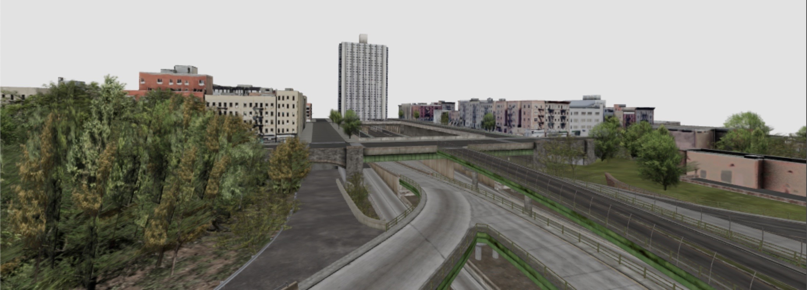

# @coconut-xr/hochhaus 🏢

> In the city's embrace, a building with grace, where elevators ascend, and dreams find their space. - ChaptGPT

Try it out [here](coconut-xr.github.io/hochhaus/) using a Quest 3 or similar.

**Requires windows and walls to be setup**

Check out our [release video](https://x.com/coconut_xr/status/1715045684083085677?s=20)
---

Made with [`@coconut-xr/natuerlich`](https://github.com/coconut-xr/natuerlich), [`react-three-fiber`](https://github.com/pmndrs/react-three-fiber), and [`three.js`](https://github.com/mrdoob/three.js).

## Credits

* City Model - [99.Miles](https://sketchfab.com/99.Miles)
* Elevator Texture - [SCI-FI PANEL - PBR0331](https://www.textures.com/download/PBR0407/137280)
* Door Texture - [Textures.com](https://www.textures.com/)
* Wall Texture - [Textures.com](https://www.textures.com/)

_The demo lacks some features, so feel free to add your own implementations! We'd love to see your videos about them! Pull requests are welcome!_ 🤗

---

**Hochhaus** is funded by [Coconut Capital](https://coconut.capital/)